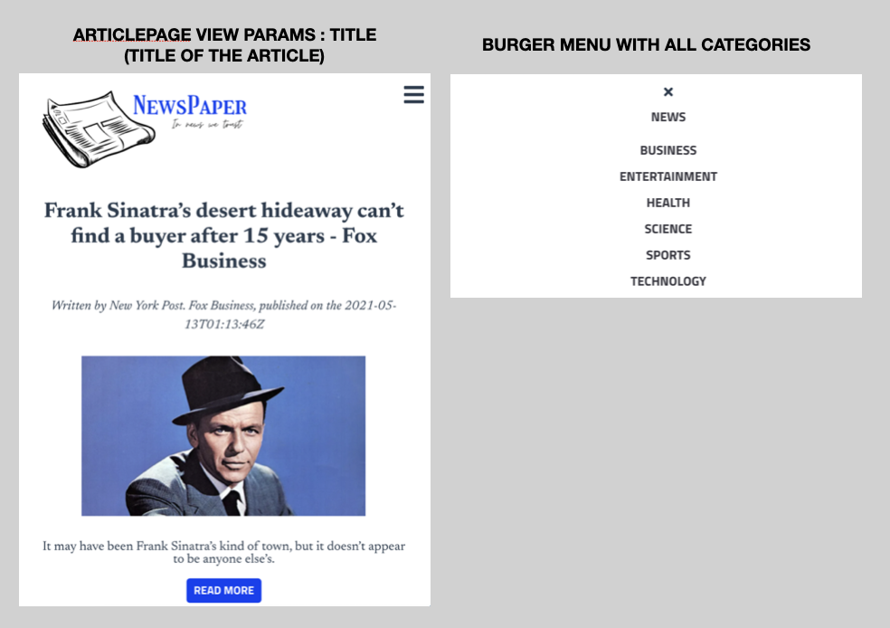

# news-app

Creation of a News website, fetching the top news from the [News API](https://newsapi.org/) in different categories. 





## Mission objectives 

To discover the Vuejs framework and develop a first small project with it to discover its features and how it works. 
The discovery of the framework and the project was realized in less than 2 weeks.

## What I learned 

In this project I learned about : Vue router, Vuex, vue components, how to connect an Api with axios, vue stores and using store modules, Base components... 

## Project setup
```
npm install
```

### Compiles and hot-reloads for development
```
npm run serve
```

### Compiles and minifies for production
```
npm run build
```

### Lints and fixes files
```
npm run lint
```

### Customize configuration
See [Configuration Reference](https://cli.vuejs.org/config/).
